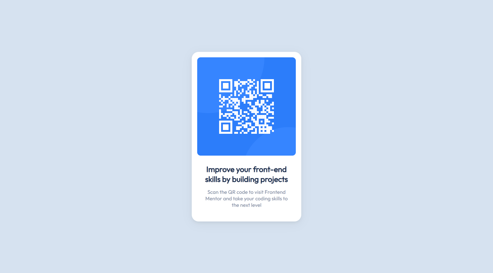

# Frontend Mentor - QR code component solution

This is a solution to the [QR code component challenge on Frontend Mentor](https://www.frontendmentor.io/challenges/qr-code-component-iux_sIO_H).

## Table of contents

- [Frontend Mentor - QR code component solution](#frontend-mentor---qr-code-component-solution)
  - [Table of contents](#table-of-contents)
  - [Overview](#overview)
    - [Screenshots](#screenshots)
    - [Links](#links)
  - [My process](#my-process)
    - [Built with](#built-with)
    - [What I learned](#what-i-learned)
    - [Continued development](#continued-development)
  - [Author](#author)

## Overview

### Screenshots

  

  

### Links

- Solution URL: [QR Code](https://github.com/tu1ip/qr)
- Live Site URL: [QR Page](https://tu1ip.github.io/qr/)

## My process

### Built with

- Semantic HTML5 markup
- CSS custom properties
- Flexbox
  
### What I learned

In this first challenge I learned how to create and edit markdown files.

### Continued development

I want to continue to focus on CSS, the use of flexbox and the BEM methodology.

## Author

- Frontend Mentor - [@tu1ip](https://www.frontendmentor.io/profile/tu1ip)
